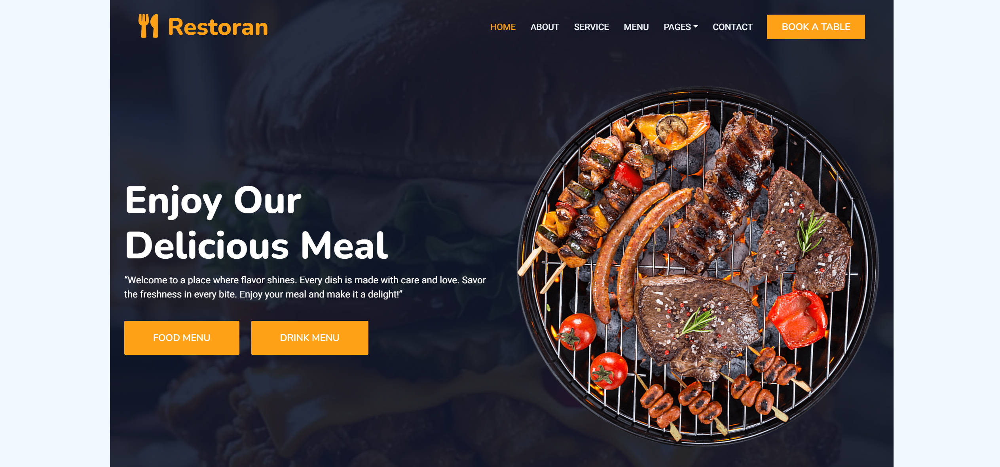

# DineFlow v2.1 Project Structure

This document systematically lists every key file within the project hierarchy, explaining the purpose, type, and functionality of every major file and directory within the project's architecture.

## Table of Contents

1. [Introduction](#introduction)
2. [Technology Stack Overview](#technology-stack-overview)
3. [Root Directory](#root-directory)
4. [Backend Application (apps/api)](#backend-application-appsapi)
5. [Frontend Application (apps/web)](#frontend-application-appsweb)
6. [Shared Packages (packages/)](#shared-packages-packages)
7. [Documentation (docs/)](#documentation-docs)

---

## Introduction

_DineFlow v2.1_ is a modern restaurant management system built as a Turborepo monorepo. The application is logically divided into an **API service** and a **Web client**.



### Core Objectives

- High performance
- Type safety
- **Scalability**

---

## Technology Stack Overview

The stack emphasizes modern TypeScript-based web technologies.

| Tier         | Primary Framework       | Key Libraries / Protocols            | Purpose                             |
| :----------- | :---------------------- | :----------------------------------- | :---------------------------------- |
| **Frontend** | Next.js 15 (App Router) | Tailwind CSS, Zustand, Apollo Client | UI and Client-side State Management |
| **Backend**  | NestJS 10               | GraphQL (Code-First), WebSockets     | API services and Real-time events   |
| **Database** | PostgreSQL              | Drizzle ORM, Redis                   | Data persistence and Caching        |

---

## Root Directory

The root directory contains monorepo configuration, CI/CD workflows, and core tooling settings.

- **`.cursorrules`**: AI coding standards and instructions specifically tailored for the IDE to maintain code style consistency.
- **`.dockerignore`**: Excludes unnecessary files from Docker builds (like `node_modules` or `.git`) to keep images lightweight.
- **`.env.example`**: Template for environment variables needed across the workspace.
- **`.eslintrc.js`** / **`.prettierrc`**: Root ESLint and Prettier configuration for code formatting and linting rules.
- **`.gitignore`**: Standard Git ignore rules.
- **`.npmrc`**: NPM/PNPM configuration (e.g., setting strict-peer-dependencies or registry).
- **`commitlint.config.js`**: Enforces conventional commit message formatting across the repository.
- **`docker-compose.yml`**: Orchestrates multi-container setup (e.g., API, Web, PostgreSQL, Redis) for local development and deployment.
- **`package.json`** / **`pnpm-workspace.yaml`**: Root package files defining the Monorepo structure (Turborepo) and shared development dependencies.
- **`turbo.json`**: Turborepo pipeline configuration, defining build, test, and dev task execution order and caching strategies.
- **`README.md`**: Primary project entry documentation.

#### Example configuration from `turbo.json`:

```json
{
  "$schema": "https://turbo.build/schema.json",
  "pipeline": {
    "build": {
      "dependsOn": ["^build"],
      "outputs": ["dist/**", ".next/**"]
    }
  }
}
```

---

## Backend Application (apps/api)

The backend application powered by NestJS, utilizing GraphQL for API communication, Drizzle ORM for database interactions, and Redis for caching.

### Configuration

- **`Dockerfile`** / **`docker-entrypoint.sh`**: Instructions for containerizing the API and the entrypoint script executed when the container starts.
- **`drizzle.config.ts`**: Defines Drizzle ORM configuration for pushing schema changes to PostgreSQL.
- **`nest-cli.json`**: Configuration for the NestJS CLI (compiler options, source roots).
- **`package.json`** / **`tsconfig.json`**: Dependencies and TypeScript configuration scoped to the API app.

### Source Code (`src/`)

- **`app.module.ts`**: Root NestJS module importing all core infrastructure and feature modules (Auth, Menu, Order, Events).
- **`app.resolver.ts`**: Root GraphQL resolver providing base queries.
- **`main.ts`**: Application bootstrap entry point. Initializes NestJS factory, configures global validation pipes, and starts the server.
- **`schema.gql`**: Auto-generated Code-First GraphQL schema file.

#### Infrastructure Modules

- **`infrastructure/database/`** (`database.module.ts`, `database.service.ts`, `schema.ts`): Configures Drizzle ORM connection to PostgreSQL and defines the database table schemas (`schema.ts`).
- **`infrastructure/redis/`** (`redis.module.ts`, `redis.service.ts`): Configures Redis connection for caching, session management, or pub/sub.

#### Feature Modules

- **`modules/auth/`**: Authentication and Authorization module.
  - `auth.module.ts` / `auth.resolver.ts` / `auth.service.ts`: Module definition, GraphQL queries/mutations for login/registration.
  - `dto/`: Input validation objects (`login.input.ts`, `register.input.ts`, `guest-session.input.ts`).
  - `guards/` & `strategies/`: NestJS Guards and Passport strategies (`jwt.strategy.ts`, `guest-token.strategy.ts`, `gql-auth.guard.ts`) protecting GraphQL endpoints.
- **`modules/events/`**: WebSocket integration.
  - `events.module.ts` / `events.gateway.ts` / `events.interface.ts`: Socket.io gateway for real-time features like order status updates and kitchen notifications.
- **`modules/menu/`**: Restaurant Menu management.
  - `menu.module.ts` / `menu.resolver.ts` / `menu.service.ts`: Handles CRUD operations for food/drink items.
- **`modules/order/`**: Order processing and cart management.
  - `order.module.ts` / `order.resolver.ts` / `order.service.ts`: Logic for cart manipulation, order placement, and status tracking.

##### Deep Dive: Menu Models

###### `models/menu-item.model.ts`

GraphQL representation of a menu item, mapping directly to the DB schema via Drizzle ORM.

---

## Frontend Application (apps/web)

The customer and staff-facing web application built with Next.js 15 (App Router), Tailwind CSS, Apollo Client, and Zustand.

### Configuration

- **`next.config.mjs`**: Next.js build and routing configuration.
- **`tailwind.config.js`** / **`postcss.config.cjs`**: Tailwind styling rules and plugins.
- **`components.json`**: `shadcn/ui` library configuration.
- **`auth.ts`**: NextAuth.js configuration for session management and OAuth integrations.

### Source Code (`app/` & `components/`)

- **`app/layout.tsx`** / **`app/page.tsx`**: Root HTML layout, landing page, and global CSS.
- **`app/(auth)/`**: Route group for authentication pages (`login/page.tsx`, `register/page.tsx`, `staff/login/page.tsx`).
- **`app/(customer)/`**: Customer-facing secure routes (`checkout/page.tsx`, `orders/page.tsx`, `profile/page.tsx`).
- **`app/(staff)/`**: Staff portals (`kitchen/page.tsx`, `manager/page.tsx`, `waiter/page.tsx`).
- **`components/ui/`**: Base `shadcn/ui` components (`button.tsx`, `card.tsx`, `input.tsx`, `alert-dialog.tsx`, `sheet.tsx`, `toast.tsx`, etc.).
- **`components/menu/`**: Menu-specific UI (`MenuItemCard.tsx`, `CartDrawer.tsx`).
- **`components/mobile/`**: Mobile-optimized layouts (`MobileHeader.tsx`, `BottomNavigation.tsx`, `CartSheet.tsx`).

### State & Hooks

- **`store/authStore.ts`**: Client-side user session and role state (Zustand).
- **`store/cartStore.ts`**: Shopping cart item tracking and calculations (Zustand).
- **`hooks/useSocket.ts`**: Custom hook for WebSockets.
- **`lib/graphql/`**: Client-side GraphQL queries and mutations.

---

## Shared Packages (packages/)

Internal libraries consumed by the `api` and `web` applications, managed by Turborepo.

1. **`eslint-config/`**: Shared ESLint configurations (`base.js`, `next.js`, `react-internal.js`).
2. **`typescript-config/`**: Shared `tsconfig` bases (`base.json`, `nextjs.json`, `react-library.json`).
3. **`ui/`**: Shared UI component library (currently holding base `button.tsx`, `card.tsx`, `code.tsx`).

---

## Documentation (docs/)

Internal documentation, specifications, and design assets.

- **`01-prd.md`** - **`06-ux-enhancements.md`**: Core product documentation detailing Product Requirements, System Design, UX wireframes, Feature breakdowns, and AI prompting guides.
- **`design-images/`**: Visual references and mockups for the UI.
- **`postman/`**: Postman collections and environments for API testing.
- **`static/`**: A fully static HTML/CSS/JS version of a legacy template serving as a visual reference for the Next.js migration.

> **Note**: For details on the UX, see [`06-ux-enhancements.md`](./06-ux-enhancements.md).
